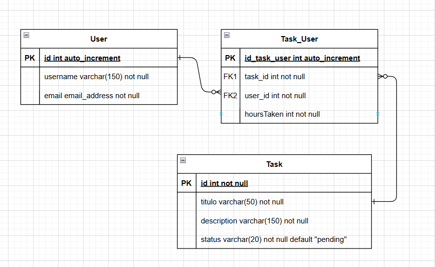

# Tasks Project

A Django REST API for managing tasks and assigning users to tasks.

## Entity Relationship Diagram



## Features

- User management (view, edit)
- Task management (CRUD)
- Assign users to tasks and track hours taken
- MySQL database backend
- RESTful API using Django REST Framework

## Setup

1. **Clone the repository**

2. **Install dependencies**

   ```
   pip install -r requirements.txt
   ```

3. **Configure the database**

   Update the `DATABASES` setting in [`tasksProject/settings.py`](tasksProject/settings.py) if needed.

4. **Apply migrations**

   ```
   python manage.py migrate
   ```

5. **Create a superuser (optional)**

   ```
   python manage.py createsuperuser
   ```

6. **Run the development server**
   ```
   python manage.py runserver
   ```

## API Endpoints

- `/users/` - User management
- `/tasks/` - Task management
- `/user-tasks/` - Assign users to tasks

API authentication is enabled via Django REST Framework's session authentication.
